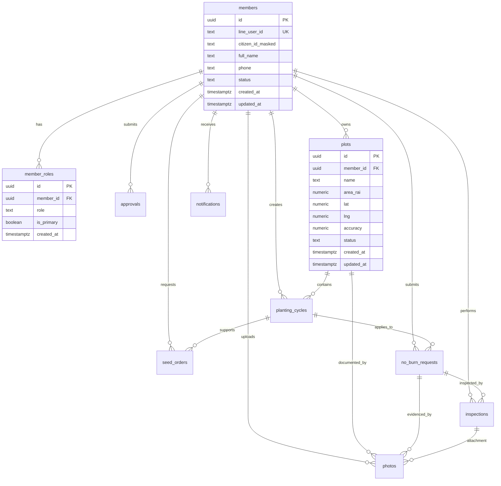

# Database ERD + Supabase Schema (Issue #2)

## Purpose
Define an MVP-ready relational schema for KaonA Agri LINE Mini App on Supabase (PostgreSQL), aligned to the approved MVP scope, workflows, entities, and role model.

## ERD (Mermaid)

## Design Notes
- Uses UUID primary keys on all domain tables.
- Stores only masked citizen ID in the main member table for normal operational access.
- Normalizes multi-role users through `member_roles` to support farmer + leader scenarios.
- Tracks workflow status fields on request/approval entities for lifecycle progression.
- Preserves field/photo attribution metadata required by coding rules (`created_by`, `role_used`, `timestamp`, `uploaded_by`, geo metadata).

## Supabase/PostgreSQL DDL
Reference SQL file: `supabase/migrations/202605060001_issue_2_schema.sql`.

## Suggested Next Steps (non-blocking)
1. Add Row-Level Security policies per role (`farmer`, `leader`, `inspector`, `truck_owner`, `staff`, `admin`, `service_account`).
2. Add trigger function for `updated_at` maintenance.
3. Add seed data for role enums and status lifecycle examples.

## OCR + GPS Extension (Issue #17)
Reference SQL file: `supabase/migrations/202605060003_issue_17_ocr_gps_schema.sql`.

### Added member OCR fields
- `members.citizen_id_ocr_text` for raw OCR result before masking/review.
- `members.citizen_id_ocr_confidence` in range `0..1`.
- `members.citizen_id_ocr_status` lifecycle: `not_started`, `captured`, `needs_review`, `accepted`, `rejected`, `manual_override`.
- `members.citizen_id_ocr_payload` (JSONB) for provider metadata and extraction details.
- `members.citizen_id_ocr_processed_at`, `members.citizen_id_verified_at` timestamps.

### Added GPS quality fields
- `plots.gps_source`, `plots.gps_status`, `plots.gps_captured_at`, `plots.gps_verified_at`.
- `photos.gps_source`, `photos.gps_status`, `photos.gps_verified_at`.

These fields support MVP requirements for OCR/manual fallback and GPS evidence quality controls.
