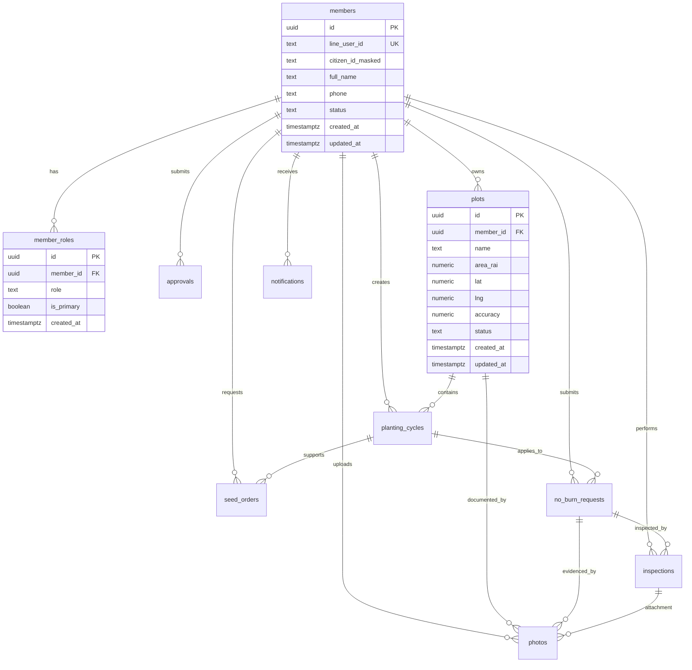

# Database ERD + Supabase Schema (Issue #2)

## Purpose
Define an MVP-ready relational schema for KaonA Agri LINE Mini App on Supabase (PostgreSQL), aligned to the approved MVP scope, workflows, entities, and role model.

## ERD (Mermaid)

## Design Notes
- Uses UUID primary keys on all domain tables.
- Stores only masked citizen ID in the main member table for normal operational access.
- Normalizes multi-role users through `member_roles` to support farmer + leader scenarios.
- Tracks workflow status fields on request/approval entities for lifecycle progression.
- Preserves field/photo attribution metadata required by coding rules (`created_by`, `role_used`, `timestamp`, `uploaded_by`, geo metadata).

## Supabase/PostgreSQL DDL
Reference SQL file: `supabase/migrations/202605060001_issue_2_schema.sql`.

## Suggested Next Steps (non-blocking)
1. Add Row-Level Security policies per role (`farmer`, `leader`, `inspector`, `truck_owner`, `staff`, `admin`, `service_account`).
2. Add trigger function for `updated_at` maintenance.
3. Add seed data for role enums and status lifecycle examples.

## OCR + GPS Extension (Issue #17)
Reference SQL file: `supabase/migrations/202605060004_issue_17_ocr_gps_schema.sql`.

### OCR data privacy + manual fallback
- OCR results are stored in `public.ocr_results` (separate from `members`) for review workflow isolation.
- Do **not** store full citizen ID plaintext in operational tables; store masked ID (`extracted_citizen_id_masked`) and optional hash (`citizen_id_hash`) only.
- Manual fallback is supported through `status` (`pending`, `accepted`, `rejected`, `manual_review`) and reviewer fields (`reviewed_by`, `reviewed_at`).

### GPS evidence validation
- `photos` includes evidence review fields: `gps_source`, `gps_verified`, `gps_distance_to_plot_m`, `evidence_status`, `reviewed_by`, `reviewed_at`.
- GPS source and evidence lifecycle are constrained for consistent moderation and audit.

### MVP boundary
- MVP uses point-based `lat/lng` capture for plots and photos.
- Polygon/geofence validation is explicitly deferred to Phase 2.

### Image preprocessing requirements (OCR + evidence photos)
- Resize/compress large uploads before storage to reduce bandwidth and storage cost while preserving enough quality for OCR and inspection review.
- Store an optimized image for normal app usage; do not store oversized originals unless explicitly required for audit/legal reasons.
- For OCR images, crop document/card region before OCR where feasible and remove unnecessary borders/background.
- For field evidence images, avoid cropping that removes critical context (plot surroundings, GPS-relevant cues, or inspection evidence).

### Image metadata + storage traceability
- Preserve capture metadata through processing: `captured_at`, `lat`, `lng`, `accuracy`, `uploaded_by`.
- Track processed image properties: `width_px`, `height_px`, and `file_size_bytes`.
- Persist processing lifecycle in `processing_status` (`pending`, `processed`, `failed`, `skipped`).
- If original files are retained, store in `original_storage_path` and processed in `processed_storage_path`.
- If originals are not retained, store only processed image path plus processing metadata.

### Privacy + retention requirements
- OCR/ID card images must be minimized and retained only as required by policy.
- OCR metadata must never store full citizen ID plaintext.
- Prefer masked OCR values and optional hashes in operational workflows.
