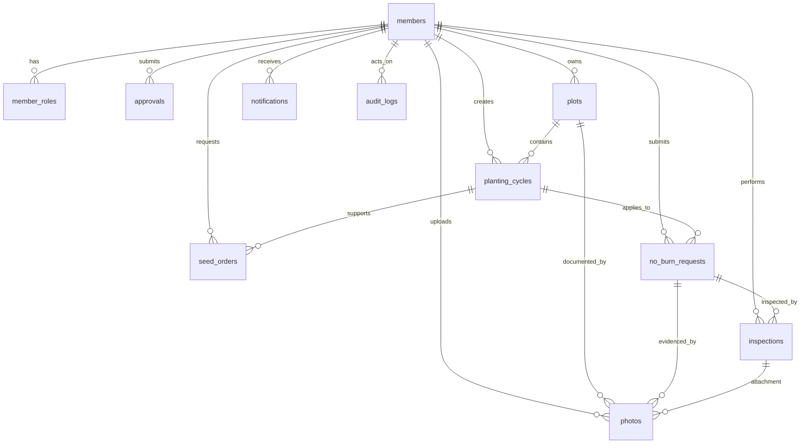

# Database ERD + Supabase Schema (Issue #2 + Issue #16)

## Purpose
Define and harden an MVP-ready relational schema for KaonA Agri LINE Mini App on Supabase (PostgreSQL), aligned to approved MVP workflows and auditability requirements.

## ERD (Mermaid)

## Issue #16 Hardening Summary
- Added soft-delete columns (`deleted_at`, `deleted_by`) to: `members`, `plots`, `planting_cycles`, `seed_orders`, `no_burn_requests`, `inspections`, `photos`.
- Added `audit_logs` table for immutable activity trace (actor, role, action, resource, before/after payload, request context, timestamp).
- Added photo metadata columns on `photos`: `mime_type`, `file_size_bytes`, `photo_type` with controlled domain check.
- Aligned status/channel constraints to approved Issue #16 lifecycle values.
- Added status, soft-delete, audit, and photo-type indexes for common operational filters.

## Soft Delete Strategy
- Domain rows are logically deleted via `deleted_at` + `deleted_by` instead of immediate hard delete.
- `deleted_by` references `public.members(id)` for accountability.
- Query patterns should default to `deleted_at is null` for active data views.
- Soft-delete indexing is included for cleanup jobs, admin review, and filtered list performance.

## Audit Log Strategy
- `public.audit_logs` captures who changed what and when.
- `old_data` and `new_data` are `jsonb` for flexible before/after snapshots.
- `resource_type/resource_id` supports cross-entity timeline lookups.
- `actor_member_id/created_at` supports actor-centric investigations and compliance checks.

## Photo Metadata & Privacy Note
- `mime_type` and `file_size_bytes` support validation, storage governance, and troubleshooting.
- `photo_type` enforces allowed classifications: `plot`, `no_burn`, `inspection`, `id_card`, `other`.
- Presence of `id_card` classification is for compliance-sensitive handling; access control must continue to rely on existing RLS and application permission rules.
- Soft-delete support on photos helps retention workflows without immediate destructive deletion.

## Status Lifecycle Overview
- `members.status`: `pending`, `approved`, `rejected`, `suspended`
- `approvals.status`: `pending`, `approved`, `rejected`, `cancelled`
- `plots.status`: `active`, `inactive`, `pending_review`
- `planting_cycles.status`: `planned`, `growing`, `completed`, `cancelled`
- `seed_orders.status`: `requested`, `under_review`, `approved`, `rejected`, `fulfilled`, `cancelled`
- `no_burn_requests.status`: `submitted`, `under_review`, `approved`, `rejected`, `inspection_required`, `completed`
- `inspections.result_status`: `pending`, `assigned`, `passed`, `failed`, `needs_update`, `completed`
- `notifications.channel`: `in_app`, `line_push`

## Supabase/PostgreSQL DDL
- Base schema: `supabase/migrations/202605060001_issue_2_schema.sql`
- RLS + updated_at triggers: `supabase/migrations/202605060002_issue_10_rls_and_updated_at.sql`
- MVP schema completion (Issue #16): `supabase/migrations/202605060003_complete_mvp_sql_schema.sql`

## Migration Scope Notes
1. Additive-only migration (no rewrites of previous migrations).
2. No removal of existing RLS policies.
3. No frontend/API/auth flow changes.
